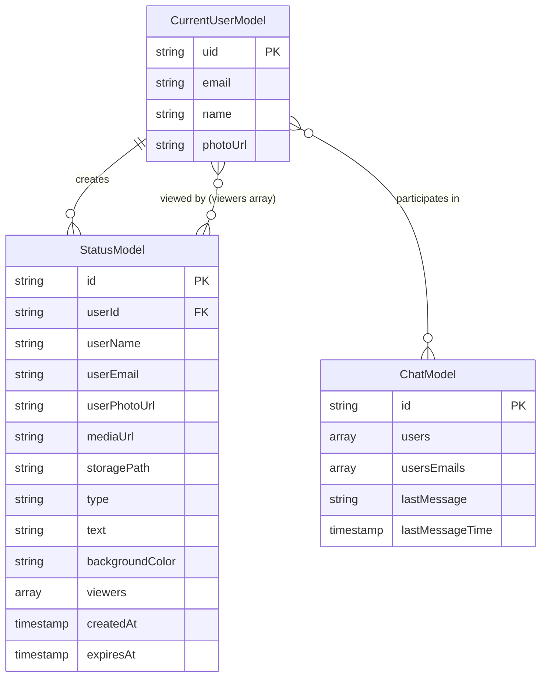
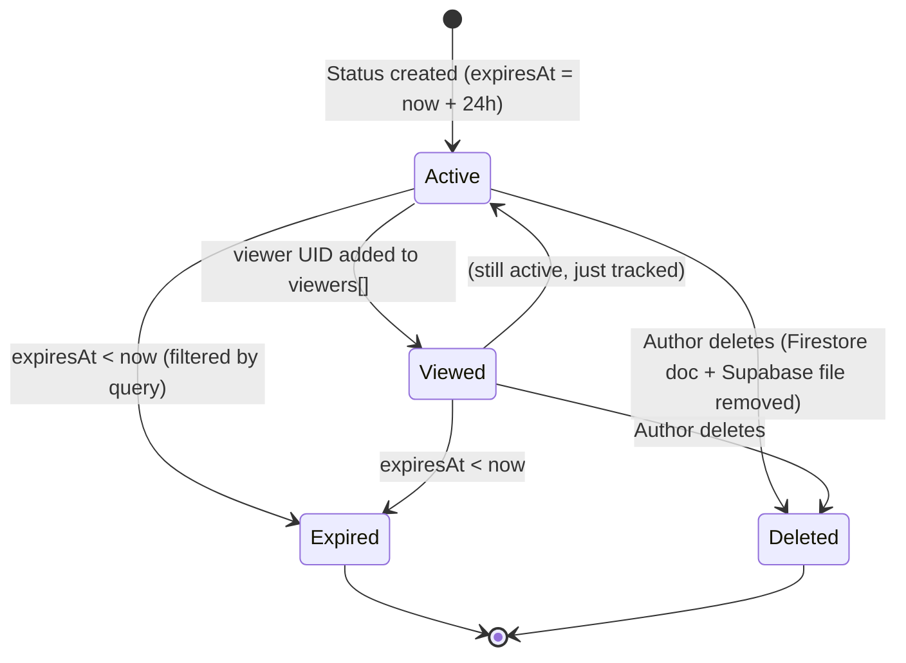

# Data Model: Status / Updates Feature

**Feature Branch**: `004-status-updates` | **Date**: 2026-05-07

## Entities

### StatusModel (Primary Entity)

**Firestore Collection**: `statuses` (root-level, flat)
**Dart Class**: `StatusModel` — `@JsonSerializable()` with `json_serializable`

| Field             | Dart Type        | Firestore Type     | Required | Default        | Notes                                              |
|-------------------|------------------|--------------------|----------|----------------|----------------------------------------------------|
| `id`              | `String`         | `string`           | ✓        | —              | Firestore document ID                              |
| `userId`          | `String`         | `string`           | ✓        | —              | Author's Firebase Auth UID                         |
| `userName`        | `String`         | `string`           | ✓        | —              | Denormalized from `CurrentUserModel.name`          |
| `userEmail`       | `String`         | `string`           | ✓        | —              | Denormalized from `CurrentUserModel.email`         |
| `userPhotoUrl`    | `String?`        | `string \| null`   |          | `null`         | Denormalized from `CurrentUserModel.photoUrl`      |
| `mediaUrl`        | `String`         | `string`           | ✓        | `''`           | Supabase public URL for image; empty for text type |
| `storagePath`     | `String`         | `string`           | ✓        | `''`           | Supabase storage path; empty for text type         |
| `type`            | `String`         | `string`           | ✓        | —              | `'image'` or `'text'`                              |
| `text`            | `String?`        | `string \| null`   |          | `null`         | Text content (text status only)                    |
| `backgroundColor` | `String?`        | `string \| null`   |          | `null`         | Hex color string (text status only)                |
| `viewers`         | `List<String>`   | `array<string>`    | ✓        | `[]`           | UIDs of users who viewed this status               |
| `createdAt`       | `DateTime?`      | `Timestamp`        |          | `Timestamp.now()` | Custom `@JsonKey` with Timestamp converter      |
| `expiresAt`       | `DateTime?`      | `Timestamp`        |          | `now + 24h`    | Custom `@JsonKey` with Timestamp converter         |

**Firestore Document Path**: `statuses/{statusId}`

**Indexes Required**:
- Composite: `userId` ASC + `expiresAt` DESC — for "my statuses" query
- Composite: `expiresAt` ASC — for "all active statuses" query (single-field, auto-created)

### CurrentUserModel (Existing — Read Only)

**Location**: `lib/core/app/models/current_user_model.dart`
**Usage**: Read `uid`, `name`, `email`, `photoUrl` to populate author metadata when creating a status.

### ChatModel (Existing — Read Only)

**Location**: `lib/features/single_chat/data/models/chat_model.dart`
**Usage**: Query `chats` collection where `users` arrayContains current UID → extract contact UIDs from the `users` array.

## Relationships



## Supabase Storage Layout

**Bucket**: `chatapp` (existing)

```text
chatapp/
├── statuses/
│   └── {userId}/
│       ├── 1715000000000.jpg
│       ├── 1715000060000.png
│       └── ...
├── groups/        (existing)
├── chats/         (existing)
└── ...
```

**Upload path**: `statuses/{userId}/{timestamp}{extension}`
**Delete**: Remove by `storagePath` stored in the StatusModel document.

## Validation Rules

| Rule                          | Enforcement Location        |
|-------------------------------|-----------------------------|
| `text` must be non-empty      | `CreateStatusCubit` + UI    |
| `type` must be `image`/`text` | `StatusRemoteDataSource`    |
| `expiresAt > now`             | Firestore query filter      |
| `viewers` no duplicates       | `FieldValue.arrayUnion`     |
| Only author can delete        | `StatusRemoteDataSource`    |

## State Transitions


